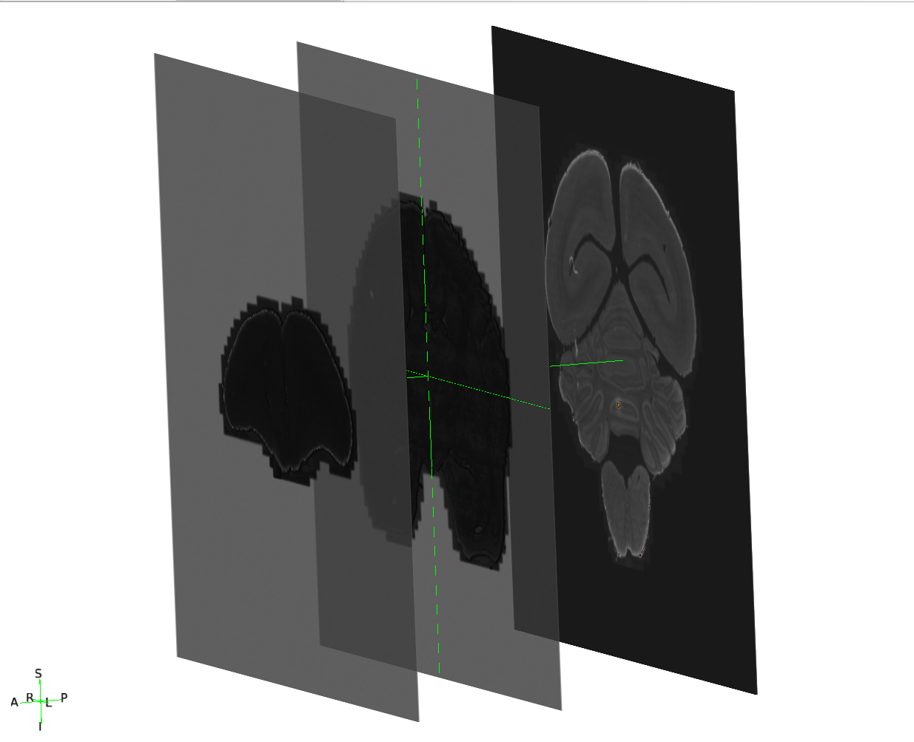
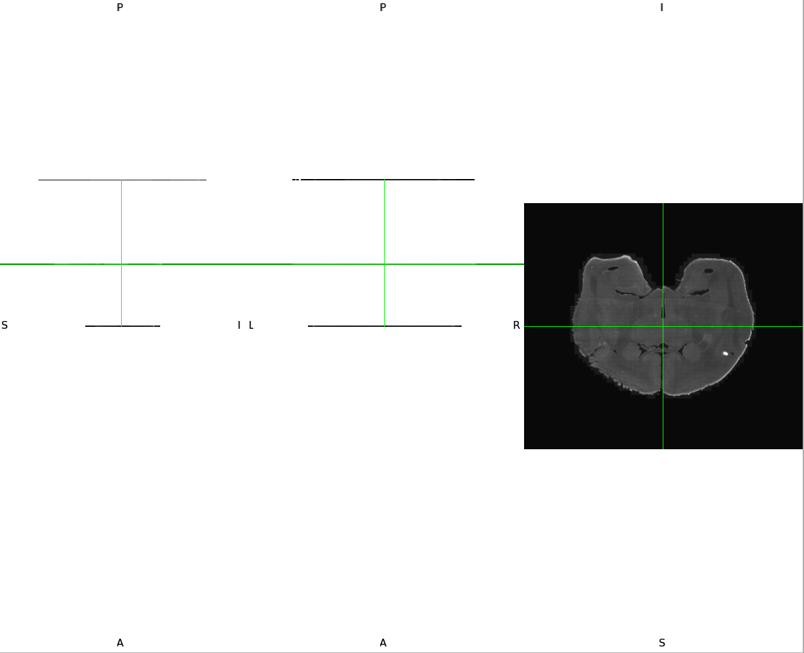

# Padding (align 2D slices)

Pads the downsampled 2D slices of a subject to a common target shape, so that
all slices — and all resolutions — can be stacked into a single 3D array later.
Reads from `derivatives/2D/downsampled/` and writes to
`derivatives/2D/padded/`. The padded slices keep the tissue at exactly the same
physical position (only the image grid grows), and their JSON sidecar is
updated with the padding metadata.

## Algorithm

1. **Scan the subject's slices** and find the **largest width** and the
   **largest height** among them.
2. **Set one common target shape** for the subject:
   `target = (max_width + padding_delta, max_height + padding_delta)`.
   If a target dimension is even, 1 pixel is added so it is always **odd**.
3. **Center each slice** inside that target with zero-padding. For each axis,
   the missing size `shift = target - slice_size` is split **in half**:
   `shift / 2` pixels before and `shift / 2` after. Slices are exported with
   odd sizes and the target is odd, so `shift` is always even and the split is
   exact, with no rounding. The tissue is not moved, it is only surrounded by
   background, so a slice that was smaller than its neighbours simply receives
   more padding.

The result: every slice of the subject ends up with the exact same shape, ready
to be stacked, while each one stays at its true physical position.

### Formal algorithm

**Require:** downsampled slices $\{I_1, \dots, I_n\}$ of one subject at one resolution, with their SForm matrices $\{A_1, \dots, A_n\}$<br>
**Require:** margin $\delta$ (`padding_delta`)<br>
**Ensure:** padded slices $\{I_k^{pad}\}$ of common size $W \times H$ and their updated SForm matrices $\{A_k^{pad}\}$

1. $W_{\max} \leftarrow \max_k \, \mathrm{width}(I_k)$
2. $H_{\max} \leftarrow \max_k \, \mathrm{height}(I_k)$
3. $W \leftarrow W_{\max} + \delta, \quad H \leftarrow H_{\max} + \delta$
4. **if** $W$ is even **then** $W \leftarrow W + 1$; **if** $H$ is even **then** $H \leftarrow H + 1$
5. **for** $k \leftarrow 1$ **to** $n$ **do**
6. &emsp; $s_x \leftarrow W - \mathrm{width}(I_k), \quad s_y \leftarrow H - \mathrm{height}(I_k)$
7. &emsp; $b_x \leftarrow s_x / 2, \quad b_y \leftarrow s_y / 2$ &emsp; *(padding before)*
8. &emsp; $a_x \leftarrow s_x - b_x, \quad a_y \leftarrow s_y - b_y$ &emsp; *(padding after)*
9. &emsp; $I_k^{pad} \leftarrow \mathrm{ZeroPad}\big(I_k, (b_x, a_x), (b_y, a_y)\big)$
10. &emsp; $A_k^{pad} \leftarrow A_k$, with origin $\; o_k^{pad} = o_k - b_x \, \mathbf{e}_x - b_y \, \mathbf{e}_y$
11. **end for**
12. **return** $\{I_k^{pad}\}$ and $\{A_k^{pad}\}$

where $o_k$ is the origin of $A_k$ (its last column) and $\mathbf{e}_x$,
$\mathbf{e}_y$ are its first two columns (the physical size and direction of one
pixel along X and Y).

Since every slice has odd dimensions (forced at conversion) and $W$, $H$ are odd,
$s_x$ and $s_y$ are always even: $b = a = s/2$ exactly. Line 10 keeps the tissue
at the same physical position. Stacking the padded slices into a 3D volume is
done in the [stacking step](04_stacking.md).

## Command

```bash
python 2D/padding/mimosa_slice_padding.py \
  -bids_root /path/to/BIDS \
  -res 4x \
  -padding_delta 100
```

## Options

| Option | What it does | Default |
|--------|--------------|---------|
| `-bids_root` | BIDS root. **Required.** | — |
| `-res` | Resolution label to pad, e.g. `4x`. **Required.** | — |
| `-padding_delta` | Padding margin added in pixels. | `100` |
| `-reorient` | Reference reorientation used to write the SForm of the padded slices. | `none` |

## Understanding the options

- **`-res`.** Slices exist in several resolutions (`4x`, `6x`, `8x`). You pad
  one resolution at a time; run the command again for each resolution you need.

- **`-padding_delta`.** Margin added to the largest slice of the subject. The
  largest slice plus this margin defines the target size. All other slices are
  then padded until they reach this target.

- **`-reorient`.** Same reference frame as the conversion step, used to compute
  the SForm of the padded slices. Keep it consistent across steps.

## Output

```text
derivatives/2D/padded/sub-<subject>/ses-<session>/micr/res-<Nx>/
  ..._desc-padded_FLUO.nii.gz
  ..._desc-padded_FLUO.json
```

The padded image's `.json` sidecar is copied from the input (downsampled) slice
and gets two extra fields: `SubjectMaxSize` (the subject's biggest slice size)
and `PaddingTargetShape` (the common padded size). It also recomputes the slice's spatial position (its SForm matrix) so it matches
the shared coordinate system of the final stacked volume.

## Example output

The same three slices as in the conversion step (`res-8x`: one **anterior**,
one at the **center** of the volume and one **posterior**) after padding.

**3D view.** The target size is defined by the largest slice plus
`padding_delta`. Every slice is padded to reach this target: the missing size,
`target − slice_size`, is split in half, with `(target − slice_size) / 2`
pixels added on each side. Smaller slices therefore receive more padding, as
seen on the anterior slice.

Padding only adds background around the tissue. The SForm matrix is updated
accordingly, so the tissue stays at its real place in the brain.



**Orthogonal views.** In the sagittal (left) and axial (middle) views, the three
slices stay at their respective depths along the A-P axis; the coronal view
shows the central slice centered in its padded frame.



## Geometry

How padding shifts the affine origin so the tissue stays at the same physical
position is explained in
[geometry.md](geometry.md#padding-and-the-affine-matrix).
